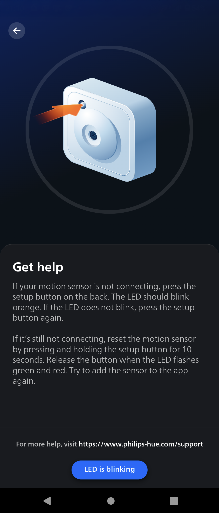

# philips-hue-auto-config💡

## Overview

This project allows to describe and automatically apply a Philips Hue Bridge configuration.

It can be used to:
* Reduce the amount of time spent on manual configuration
* Factory-reset a Hue Bridge and restore its previous configuration at any time
* Move a configuration to another Hue Bridge 
* Split an existing configuration across two Hue Bridges

## Input configuration file

### Schema
The configuration must adhere to [config-schema.json](./module/src/config/config-schema.json)

### Examples
* [simple-config.json](./samples/simple-config.json)
* [bridge1-config.json](./samples/bridge1-config.json)
* [bridge2-config.json](./samples/bridge2-config.json)

## Run the program

1. Run: `cd module && npm install` 
2. Reset the Hue Bridge, then press the button in the centre of the Hue Bridge
3. Run: `npm run start --config=../samples/your-config.json`

Additional options:
* `--bridge={ip}` - Skip Hue Bridge discovery and use the provided IP address instead
* `--appkey={key}` - Use the provided authentication key instead of creating a new one
* `--delete_devices` - Delete lights and accessories from the bridge

## Program steps

The program will:

1. Load and check the input configuration
2. Search for the bridge that was pressed
3. Create a bridge user and authentication key
4. Delete bridge resources
5. Add the bridge location for sunset/sunrise detection
6. Create rooms and zones
7. Search for lights (from their serial and MAC address) and add them to rooms and zones
8. Create default "_Day_" and "_Night_" scenes for each room and zone
9. Set a default power-on behavior for all lights
10. Search for accessories and add them to the bridge
11. Configure accessories to activate scenes according to sunset/sunrise
12. Create default "_Motion sensor day_" and "_Motion sensor night_" scenes in each room or zone controlled by a motion sensor
13. Configure motion sensors to activate scenes according to sunset/sunrise
13. Automatically disable motion sensors when the controlled room or zone is switched on manually

## Troubleshooting

### Lights

 
 

> _Sometimes an issue with a Philips Hue smart light can be fixed by factory resetting it with the Philips Hue dimmer switch:_
> 1. _Power cycle the light: switch it off, wait 15 seconds, and switch it back on._
> 2. _Hold the Hue dimmer switch within six inches of the light._
> 3. _Press and hold both the “ON” and the “OFF” button for at least 10 seconds until the LED indicator on the switch turns green._

Source: https://www.philips-hue.com/en-us/explore-hue/blog/dimmer-switch-installation

### Wall switches

 
 

### Dimmer switches

 
 

### Motion sensors

 
 

### Tap dial switches

 
 

## References

* https://developers.meethue.com/develop/hue-api/
* https://developers.meethue.com/develop/hue-api-v2/